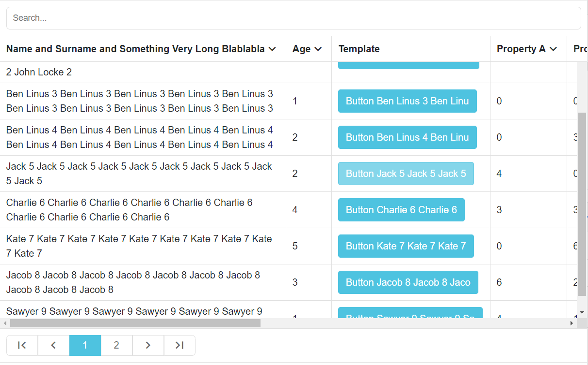
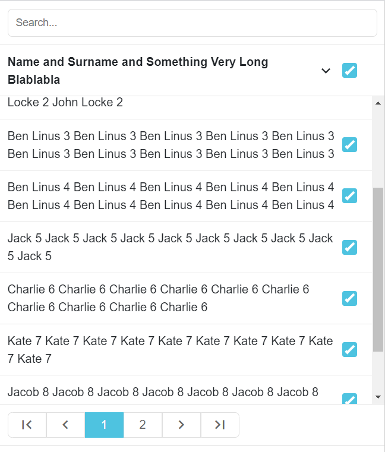
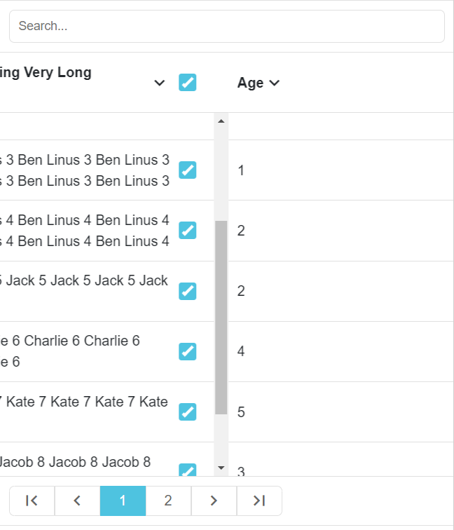
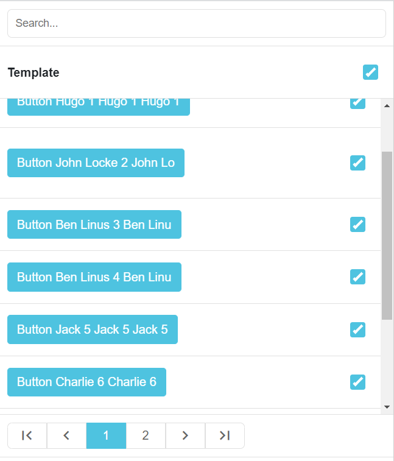

# ngdatatable - Angular Data Table

the alternative of a normal HTML table but with pagination, sorting, search, selection support and - most importantly - responsive in mobile thanks to the usage of SwiperJS! Built in Angular v9

everything one could want from a table - you have pagination, sorting, search, selection, the table headers are preserved upon scrolling so that you can always see which column you are looking at, responsive in mobile - every column is a SwiperJS slide holding a scrollable container of the rows; alongside that we make use of the angular-resize-event library which gives us the ability to listen on html element resize and determine the width based on an element instead of the window (making it a good choice to put inside a nested element because it keeps track of the occupied space and resizes itself accordingly)

* a note about the sorting - we have to provide a DataType per column header and then that DataType is used to select a proper comparison function - so naturally the supported data types are String, Number, Date (a normal Date object or an ISO string), Boolean and Template - the templates cannot be sorted - you can take a look inside the code to see how that is implemented

* you can pass in a template to be rendered by header and the ngOutletContext object for the template would be the actual row object wrapped in an object so that we can access the whole object if we need to (e.g. to bind it to ngModel) - see app.component for an example

* currently when ngOnChanges triggers it doesn't invoke the handleMobileHeadersHeights() and handleMobileRowsHeights() functions because it causes a bottleneck as we swipe - so if lets say you have passed a header with DataType.String and you change it dynamically to DataType.Template so it occupies more space the rows heights won't be updated properly - you need to do that yourself - in order to do it just create a @ViewChild(ResponsiveTableComponent) responsiveTableComponent: ResponsiveTableComponent; and then you can call this.responsiveTableComponent.resizeHandler(); to update the heights manually - the resizeHandler() function internally does exactly that

* you can pass in a propertyFunction instead of a property - that is a function which accepts an object and returns a string - so that the values in the tables are fully customizable (you can implement any custom logic easily in that function)

* if you pass both a property and a propertyFunction that means you want to use the property to sort by and use the propertyFunction for what is actually displayed (a perfect example would be having to deal with dates in ISO format and displaying them localized - you can have the dates displayed any way you like while still being able to sort them property in the table by their actual ISO strings)

* if you are copying it make sure to check out styles.scss so that you don't end up wondering why it doesn't look properly

### Desktop

### Mobile

