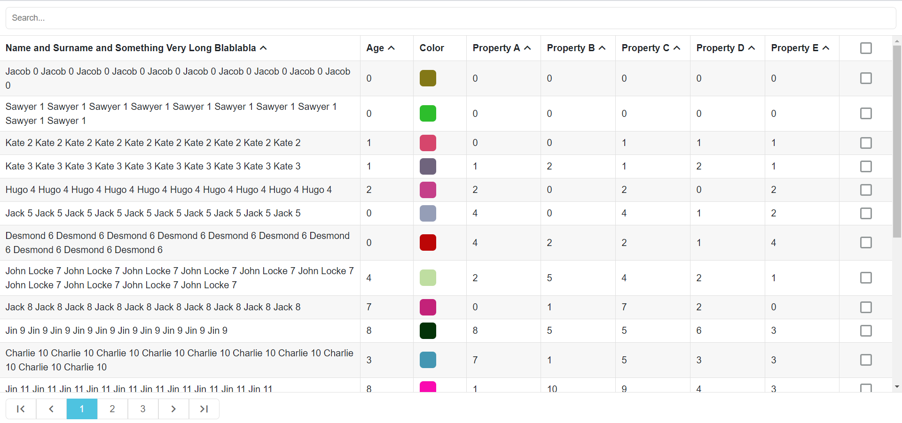
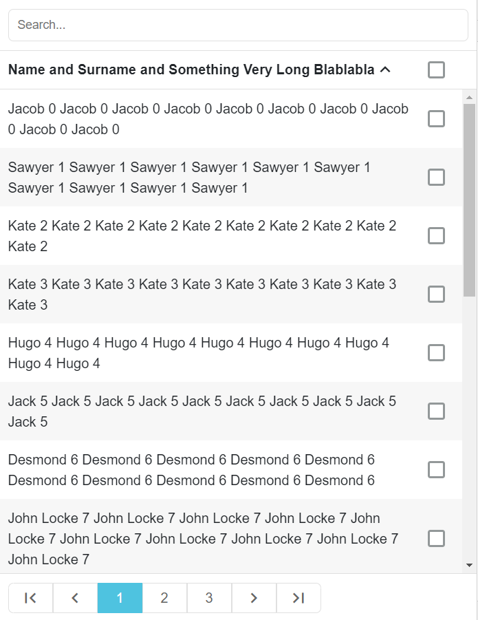
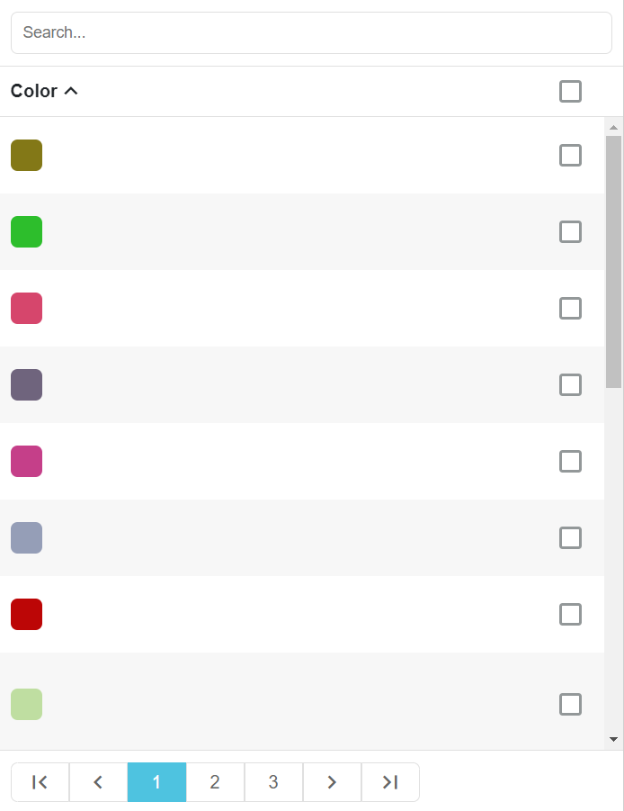

# ngdatatable - Angular Data Table

the alternative of a normal HTML table but with pagination, sorting, search, selection support and - most importantly - responsive in mobile thanks to the usage of SwiperJS! Built in Angular v9

everything one could want from a table - you have pagination, sorting, search, selection, the table headers are preserved upon scrolling so that you can always see which column you are looking at, responsive in mobile - every column is a SwiperJS slide holding a scrollable container of the rows; alongside that we make use of the angular-resize-event library which gives us the ability to listen on html element resize and determine the width based on an element instead of the window (making it a good choice to put inside a nested element because it keeps track of the occupied space and resizes itself accordingly)

* a note about the sorting - we have to provide a DataType per column header and then that DataType is used to select a proper comparison function - so naturally the supported data types are String, Number, Date (a normal Date object or an ISO string), Boolean and Template - the templates cannot be sorted - you can take a look inside the code to see how that is implemented

* if you are copying it make sure to check out styles.scss so that you don't end up wondering why it doesn't look properly

### Desktop

### Mobile

